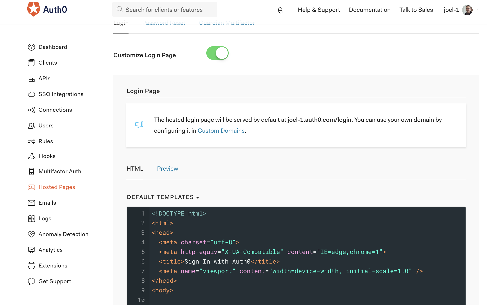

Following one of my talks at [Confoo](http://confoo.ca), I've been asked how to change the language of the authentication screen when using Auth0.  Here is a quick hack to do so.

##Customize the login page
The first step is to customize your login page.  You can do so by logging in to your Auth0 account and then click on "Hosted Pages" on the navigation menu on your left.

Then enable a customized hosted page by turning on the "Customize Login Page" option.

You should now have a screen that looks like this.


In the code, you will see a block of declarations, followed by a snippet of code that handles the language:

```
// Decode utf8 characters properly
var config = JSON.parse(decodeURIComponent(escape(window.atob('@@config@@'))));
config.extraParams = config.extraParams || {};
var connection = config.connection;
var prompt = config.prompt;
var languageDictionary;
var language;

if (config.dict && config.dict.signin && config.dict.signin.title) {
  languageDictionary = { title: config.dict.signin.title };
} else if (typeof config.dict === 'string') {
  language = config.dict;
}
```

Add this little piece of code between the declarations and right before the if that verifies the content of dict

```
var lng = location.href.match(/language=([a-z]{2})/);
if (lng && lng.length > 0) {
  config.dict = lng[1];
}
```

This little piece of code will check if you have a "language" query parameter and, if it finds one, it overwrites the config.dict value with it.

##Change your application code
In your application, you should be calling your .authorize methode like this.  This is the code that redirects you to the login page we just edited.

```
auth.authorize({
    responseType: 'token id_token',
    redirectUri: REDIRECT,
    audience: AUDIENCE,
    scope: SCOPE
});
```

Now let's just add a "language" option.  By adding it to the options of "authorize", it will be added to the redirection URL.

```
auth.authorize({
    responseType: 'token id_token',
    redirectUri: REDIRECT,
    audience: AUDIENCE,
    scope: SCOPE,
    language: "fr"
});
```

Now refresh your application and try to login again, you should see your login page in french.
