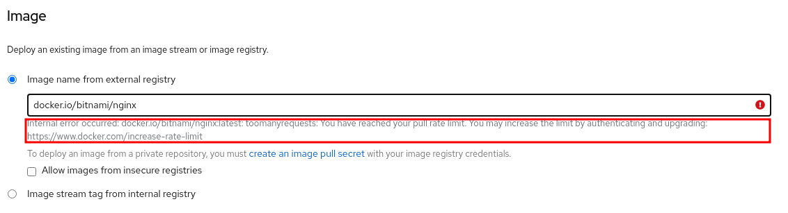

If you tried to run `oc new-app <docker-image>` on OpenShift and got a similar error message, here is how to fix it.

```
W0216 12:21:52.014221  671649 dockerimagelookup.go:237] container image registry lookup failed: docker.io/username/image:latest: toomanyrequests: You have reached your pull rate limit. You may increase the limit by authenticating and upgrading: https://www.docker.com/increase-rate-limit
```

## TLDR;
No need to upgrade your Docker account to a paid one; use a secret to pull your images as an authenticated user.

## About the error message
Docker has recently [changed their policy](https://www.docker.com/increase-rate-limits) for downloading images as an anonymous user. There is now a limit of 100 downloads for every six hours from a single IP address.

If you are using the [OpenShift Developer Sandbox](https://developers.redhat.com/developer-sandbox) to experiment with a free OpenShift cluster just like I was, you might have encountered that error message when trying to create a new application with the `oc new-app` command or from the UI, as shown in the image here.



That is because many of us are using the same cluster at the same time. Each time a user tries to create a new application from a Docker image, it downloads it as an anonymous user, which counts towards the rate limit. Eventually, across all cluster users, the limit is reached, and this error message pops up.

## Working around this issue
To fix this issue, you can authenticate to your Docker Hub account. By doing so, the image won't be pulled as an anonymous user anymore but as an authenticated user. This download will now be counted against your personal limit of 200 downloads per six hours instead of the 100 downloads shared across all the cluster users.

To authenticate, you can use the following command:

```
oc create secret docker-registry docker --docker-server=docker.io --docker-username=<username> --docker-password=<password> --docker-email=<email>
oc secrets link default docker --for=pull
oc new-app <username>/<image> --source-secret=docker
```

Note that it is recommended that you [use an access token](https://docs.docker.com/docker-hub/access-tokens/) here instead of your actual password. Using an access token is also the only way to authenticate if you have two-factor authentication enabled on your Docker Hub account.

If you prefer to use the UI, as I do, you can click on "create an image pull secret," as seen here.


That's it! You will now be able to download images without hitting that rate limit error.
