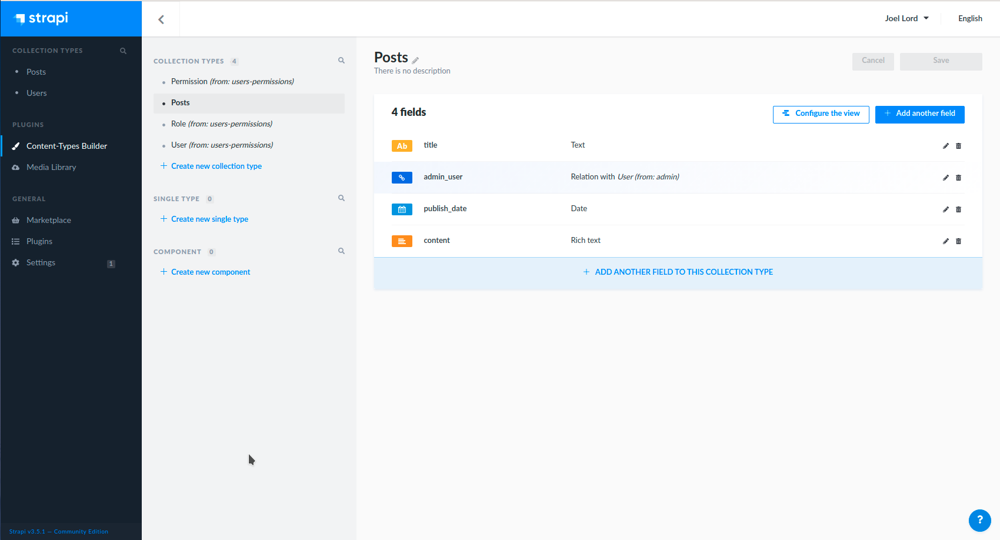

[Strapi](https://strapi.io) is the leading open-source headless content management system (CMS). It’s 100% [JavaScript](https://developers.redhat.com/topics/javascript), fully customizable, and takes a developer-first approach. Strapi provides you with an interface to create and manage all the resources for your website. You can then build a front end to connect to your Strapi API with your favorite tools and frameworks. Content editors can use the friendly administration panel to manage and distribute content. Strapi is also based on a plugin system, which makes the CMS flexible and extensible.

Once you’ve built your resources with Strapi’s administration panel and designed a nice front end to serve the content, you will need to deploy the application somewhere. This article shows you how to deploy a Strapi application on a [Kubernetes](https://developers.redhat.com/topics/kubernetes) or [Red Hat OpenShift](https://developers.redhat.com/products/openshift/overview) cluster.

## Step 1: Set up the development environment
To use Strapi in a containerized development environment, you will need three independent containers: One to run the database, another for Strapi, and one for the front end. This section shows you how to set up the three containers you will use in development.

### Initial setup
The database and back-end servers must be able to communicate. You can use a Docker network for this communication. Create your network with the following command:

```bash
docker network create strapi
```

You will also need three folders to hold the data from your containers. Here is the command to create the _/data_, _/app_, and _/front_ folders:

```bash
mkdir ./data && mkdir ./app && mkdir ./front
```

### Create the database container
To start a Strapi instance, you will need a database to persist your data. In this example, we’ll use a MySQL database server running inside a container. This way, there is no need to go through the process of installing MySQL.

To run the server, you can use the _docker run_ command with the _-d_ argument to run in the background. Include the following parameters:

* _--name_ to name the container.
* _-v_ to specify a folder to contain the data to reuse the next time you start the server.
* _-e_ to set up the environment variables to configure the database.

The command to start the container should look like this:

```bash
docker run --rm -d --name strapi-db -v $(pwd)/data:/var/lib/mysql:z --network=strapi -e MYSQL_DATABASE=strapi -e MYSQL_USER=strapi -e MYSQL_PASSWORD=strapi -e MYSQL_ROOT_PASSWORD=strapi-admin mysql:5.7


Note that we use the _--network_ parameter to connect the database container to the network we created earlier.

After executing this command, try a _docker ps_ to validate that the container has started.

### Create the back-end container
Now that you’ve configured the database, you can start your _strapi_ instance, which will run from a container. This time, you will use the _strapi/strapi_ base image. You can still use the _-d_ argument to run it in the background and _--name_ to name your container. Be sure to also add the Strapi container to the same network as the database.

You should also map your local _/app_ folder to _/srv/app_:

* Use the _-v_ parameter so that you can persist the files created by Strapi using a local folder on your machine.
* Map a port on your operating system to access port 1337 inside the container. If you are using port 8080, the address to connect to the Strapi admin console will be _localhost:8080_.
* Configure Strapi to use the database you started in the previous step using environment variables.

Here is the command to start the Strapi back-end container:

```bash
docker run --rm -d --name strapi-dev -p 8080:1337 -v $(pwd)/app:/srv/app:z --network=strapi -e DATABASE_CLIENT=mysql -e DATABASE_NAME=strapi -e DATABASE_HOST=strapi-db -e DATABASE_PORT=3306 -e DATABASE_USERNAME=strapi -e DATABASE_PASSWORD=strapi strapi/strapi
```

If Strapi can’t find any files in the local file system that you mapped, it will automatically create a new instance of a Strapi server. This can take a few minutes. You can use _docker logs_ to keep an eye on the application creation status:

```bash
docker logs -f strapi-dev
```

If you want to stop the logs in your console, enter *Ctrl-C*.

Once you see a message stating that your Strapi server is started, you can go to [http://localhost:8080/admin](http://localhost:8080/admin) to create your admin user.

After you’ve created the admin user, go ahead and create a new content type and make it publicly available. For content to work with in the next step, create a *Content-Type* for *Posts*. It will have four fields: *title*, *author* (a relationship to *Users*), *publish_date*, and *content*, as shown in Figure 1.


Figure 1: The new content type with four fields for posts.

*Note*: See [this video](https://www.youtube.com/watch?v=VC9X9O5OFyc) from the [Strapi](https://strapi.io) team for a full tutorial about creating new content types.

### Create the front-end container
Next up, you will create a front end. This user interface (UI) will consist of a simple HTML file that fetches the Strapi application programming interface (API) data and displays it on the page.

We’ll use a Nginx server to display the content. You can start the container similarly to how you started the other two. This time, map port 80 in the container to port 8888 on your local machine and mount the _/front_ folder to map to _/usr/share/nginx/html_ inside your container. The _/front_ folder is the default folder to serve files from with Nginx:

```bash
docker run --rm -d --name strapi-front -p 8888:80 -v $(pwd)/front:/usr/share/nginx/html:z nginx:1.17
```

Now, go ahead and create your front-end application. You might use a React, VueJS, or Angular application, but we’ll use a simple HTML file for this demo. The file will do a fetch from the Strapi API to download the data and then create the necessary elements on the page using JavaScript.

The HTML page will have a single _div_ where the JavaScript code appends the API’s content. Create the following _index.html_ file in the _/front_ folder:

```html
<body>
  <div id="content"></div>
</body>
```

You will need to add a _script_ tag to include a configuration file, which will make it easier to overwrite your Strapi API location later. Add the following inside the _index.html_:

```html
<script type="text/javascript" src="config.js">
```

The _front/config.js_ file should create a global constant with the following configuration:

```js
const config = {
  BASE_URL: "http://localhost:8080"
}
```

Finally, in the _index.html_ file, add another _script_ tag that contains the code to download the content and display it on the page:

```js
window.addEventListener("DOMContentLoaded", e => {
  console.log("Loading content from Strapi");

  const BASE_URL = config.BASE_URL;

  const BLOG_POSTS_URL = `${BASE_URL}/posts`;

  fetch(BLOG_POSTS_URL).then(resp => resp.json()).then(posts => {
    for(let i = 0; i < posts.length; i++) {
      let postData = posts[i];
      let post = document.createElement("div");
      let title = document.createElement("h2");
      title.innerText = postData.title;
      let author = document.createElement("h3");
      author.innerText = `${postData.author.firstname} ${postData.author.lastname} -- ${postData.publish_date}`;
      let content = document.createElement("div");
      content.innerText = postData.content;
      post.appendChild(title);
      post.appendChild(author);
      post.appendChild(content);
      document.querySelector("#content").appendChild(post);
    }
  });
});
```

Now that you’ve created all the files go to [http://localhost:8888](http://localhost:8888) to see your application. You should see your fancy UI serving content from Strapi.

## Step 2: Set up the production environment
When you are ready to deploy your application, you will need to create your own containers that contain all the necessary files and data. These containers will go live on the web.

For each container, you will need to create a Dockerfile. You will use the Dockerfiles to create your containers with the actual content. Then, you’ll deploy the containers to Kubernetes or OpenShift.

### Create the database container
There is a good chance that you already have a database in production, and you probably won’t want to overwrite its contents. For this reason, you will use the same default MySQL image that you used in development for the production database. If you want to import the SQL content later, you can use Docker to run a _mysqldump_ command on your database:

```bash
docker exec strapi-db /bin/bash -c 'mysqldump strapi -ustrapi -pstrapi' | tee strapi-db.sql
```

This file will be imported into the production database later if it’s needed.

*Note*: The _mysqldump_ command uses _tee_ to copy the contents to a file. If you don’t have the _tee_ command, you can copy the _docker_ command’s output into a file named _strapi-db.sql_.

### Create the back-end container
Next, you will create a _Dockefile.back_ to build your container for the back end.

Start from the _strapi_ base image _FROM strapi/base_. Change the working directory to _/opt/app_ and copy all the local files into the container. Next, expose port 1337 and set all your environment variables. Don’t forget to add an environment variable for _NODE_ENV=production_. Finally, execute _yarn build_ to build all the production resources and use the _CMD_ command to start the back end once the container is started.

*Note*: For more about using the Strapi base image, see the [Strapi documentation on GitHub](https://github.com/strapi/strapi-docker#how-to-use-strapibase).

```docker
FROM strapi/base
WORKDIR /opt/app
COPY ./app/package.json ./
COPY ./app/yarn.lock ./
RUN yarn install
COPY ./app .
ENV NODE_ENV production
ENV DATABASE_CLIENT=mysql
ENV DATABASE_NAME=strapi
ENV DATABASE_HOST=strapi-db
ENV DATABASE_PORT=3306
ENV DATABASE_USERNAME=strapi
ENV DATABASE_PASSWORD=strapi
RUN yarn build
EXPOSE 1337
CMD ["yarn", "start"]
```

### Create the front-end container
You’ll have to do a bit of bash scripting to use an environment variable to specify your Strapi server’s URL.

*Note*: See my [best practices for JavaScript front-end containers](https://developers.redhat.com/blog/2021/03/04/building-rootless-containers-for-javascript-front-ends/) for more about using environment variables with front-end containers.

First, start with the _nginx:1.17_ base image and change the working directory to _/usr/share/nginx/html_. In there, copy all the files from your local system into the container.

The next step involves using _sed_ to change the _BASE_URL_ value to _$BASE_URL_. Then, you will pipe in the result to a new file called _config.new.js_ and rename the file to _config.js_, overwriting the original.

The result inside the container is a new _config.js_ file that looks like the one below. Note that the original file in your local file system is left intact:

```js
const config = {
  BASE_URL: "$BASE_URL"
}
```

Finally, you will need to use _en_vsubst to change the value of _$BASE_URL_ to the environment variable’s actual value. Make the following updates in the _ENTRYPOINT_, so the changes will happen when someone issues a Docker run:

* Use a _cat_ command to pipe the _config.js_ file into _envsubst_.
* Pipe the output to _tee_ to create a new _config.new.js_ file and rename the file to overwrite the previous one.
* Use the _nginx -g 'daemon off;'_ command to start the Nginx server:

```docker
FROM nginx:1.17
WORKDIR /usr/share/nginx/html
COPY ./front/*.* ./
RUN sed s/BASE_URL\:\ \"[a-zA-Z0-9:\/]*\"/BASE_URL\:\ \"\$BASE_URL\"/g config.js > config.new.js && mv config.new.js config.js
ENTRYPOINT cat config.js |  envsubst | tee config.new.js && mv config.new.js config.js && nginx -g 'daemon off;'
```

Updating the entry point instead of a _RUN_ lets you specify different values for the base URL according to where the container is running.

### Build the containers
Now that you have all your Dockerfiles ready, you can build the containers and push them to your favorite image registry. Don’t forget to change the name of your images to use your username for that registry:

```bash
docker build -t $DOCKER_USERNAME/strapi-front -f Dockerfile.front .
docker build -t $DOCKER_USERNAME/strapi-back -f Dockerfile.back .
docker push $DOCKER_USERNAME/strapi-front
docker push $DOCKER_USERNAME/strapi-back
```

## Step 3: Package and run the application
Now that you have containers with all of your code and data, you are ready to deploy the containers somewhere. We’ll use Docker and Docker Compose to run the application and a Kubernetes or OpenShift cluster to deploy it.

### Package and run the application with Docker
If you want to run this application, you can start all the containers in the same way you would in production.

The commands to start the containers are similar to those you used in development mode, but with the mounted volumes and without the environment variables. We handled the source code and environment variables in the Dockerfile. Note that we add an environment variable specifying the location of the Strapi API for starting the front end:

```bash
docker run --rm -d --name strapi-db -v $(pwd)/data:/var/lib/mysql:z --network=strapi -e MYSQL_DATABASE=strapi -e MYSQL_USER=strapi -e MYSQL_PASSWORD=strapi -e MYSQL_ROOT_PASSWORD=strapi-admin mysql:5.7
docker run --rm -d --name strapi -p 1337:1337 --network=strapi $DOCKER_USERNAME/strapi-back
docker run --rm -d --name strapi-front -p 8080:80 -e BASE_URL=http://localhost:1337 $DOCKER_USERNAME/strapi-front
```

### Package and run the application with Docker Compose
If you want to share your application code and configurations with anyone else, you could provide them with a _docker-compose.yaml_ file. This tool lets you manage multiple containers at once without multiple bash commands:

```yaml
version: '3'
services:
  strapi-db:
    image: mysql:5.7
    volumes:
      - ./data:/var/lib/mysql
    networks:
      - strapi
  strapi-back:
    image: $DOCKER_USERNAME/strapi-back
    ports:
      - '1337:1337'
    networks:
      - strapi
  strapi-front:
    image: $DOCKER_USERNAME/strapi-front
    ports:
      - '8080:80'
    environment:
      BASE_URL: http://localhost:1337
networks:
  strapi:
```

## Step 4: Deploy the application
Once you’ve created all of your containers, you can deploy the application into a Kubernetes or OpenShift cluster. I’ll show you how to do both.

### Deploy the application on Kubernetes
Before deploying your application in a Kubernetes cluster, you will need to use YAML files to create all the necessary assets. For more details on each of these assets, see [Kubernetes by example](http://kubernetesbyexample.com/). To test out the deployment, you can use a smaller version of Kubernetes to run locally on your own machine. I’ve used [Minikube](https://kubernetes.io/docs/tutorials/hello-minikube/) for the following examples.

### Deploying the database
The setup for [persistent volumes](https://kubernetesbyexample.com/pv/) (PVs) and persistent volume claims (PVCs) varies from one cloud provider to another. For this reason, the database in this example will not persist data. For more information about how to persist data, check your cloud provider’s documentation.

For the database, we will need to create a [deployment](https://kubernetesbyexample.com/deployments/). You will start by creating a YAML file that describes your deployment. You can give it a name, and in the spec, you will create a template for the pods. Each pod will have a single container, which will be the ones that you’ve pushed to your registry. Here is the deployment for this example (_deploy-db.yaml_):

```yaml
apiVersion: apps/v1
kind: Deployment
metadata:
  name: strapi-db
spec:
  selector:
    matchLabels:
      component: db
  template:
    metadata:
      labels:
        component: db
    spec:
      containers:
      - name: strapi-db
        image: mysql:5.7
        env:
          - name: MYSQL_DATABASE
            value: strapi
          - name: MYSQL_USER
            value: strapi
          - name: MYSQL_PASSWORD
            value: strapi
          - name: MYSQL_ROOT_PASSWORD
            value: strapi-admin
```

Once you have your file, you can apply it to your cluster using _kubectl_:

```bash
kubectl apply -f ./deploy-db.yaml
```

### Deploying the back end
Your back end needs to be able to find the pods inside the cluster, so you will need to create a [Service](https://kubernetesbyexample.com/services/) to expose each pod. We are using the defaults here, so you can use kubectl to create this service:

```bash
kubectl expose deployment strapi-db --port 3306
```

If you want to import data from your development environment SQL, you can run the following commands:

```bash
kubectl cp ./strapi-db.sql $(kubectl get pod -l component=db | awk 'NR>1 {print $1}'):/tmp/strapi-db.sql
kubectl exec -t $(kubectl get pod -l component=db | awk 'NR>1 {print $1}') -- /bin/bash -c 'mysql strapi -ustrapi -pstrapi < /tmp/strapi-db.sql'
```

These commands copy the SQL file to the pods, then run a MySQL command to run it in the database.

You can also create your deployments for the back- and front-end portions of your application. The Strapi back end (_deploy-back.yaml_) is the same as the database deployment, apart from the name, label, and container image:

```yaml
apiVersion: apps/v1
kind: Deployment
metadata:
  name: strapi-back
spec:
  selector:
    matchLabels:
      app: strapi
      component: back
  template:
    metadata:
      labels:
        app: strapi
        component: back
    spec:
      containers:
      - name: strapi-back
        image: joellord/strapi-back
```

### Deploying the front end
The front end (_deploy-front.yaml_) uses a similar structure to the back end, but you also need to set the environment variable for the back end’s _BASE_URL_. For now, just set that variable’s value to _/api_. You also need to expose the container to port 80 so that it will be available to the outside world eventually:

```yaml
apiVersion: apps/v1
kind: Deployment
metadata:
  name: strapi-front
spec:
  selector:
    matchLabels:
      component: front
  template:
    metadata:
      labels:
        component: front
    spec:
      containers:
      - name: front
        image: joellord/strapi-front
        ports:
          - containerPort: 80
        env:
          - name: BASE_URL
            value: /api
```

### Create and expose the application services in your cluster
Now that you’ve created your deployment files, you can apply them to your cluster and create the services for each one:

```bash
kubectl apply -f ./deploy-back.yaml
kubectl apply -f ./deploy-front.yaml
kubectl expose deployment strapi-back --port 1337
kubectl expose deployment strapi-front --port 80
```

Everything is now running inside your cluster. You only need to expose the front- and back-end services to the outside world. For this, you will use an [ingress](https://kubernetes.io/docs/concepts/services-networking/ingress/).

Here, you will create an ingress that exposes the front end as the default service. Any incoming request to your cluster then goes to the front end by default. You will also add a rule that redirects any traffic sent to  _/api/*_ to the back-end service. The request will be rewritten when it’s sent to that service to remove the _/api_ part of the URL. We’ll add a Nginx annotation in the metadata to effect this change. Here is the _ingress.yaml_ file:

```yaml
apiVersion: networking.k8s.io/v1
kind: Ingress
metadata:
  name: main-ingress
  annotations:
    nginx.ingress.kubernetes.io/rewrite-target: /$2
spec:
  rules:
  - http:
      paths:
        - path: /api(/|$)(.*)
          pathType: Prefix
          back end:
            service:
              name: strapi-back
              port:
                number: 1337
        - path: /()(.*)
          pathType: Prefix
          backend:
            service:
              name: strapi-front
              port:
                number: 80
```

Go ahead and apply this file to your cluster. You might need to enable the following add-on if you are using Minikube and have never used an ingress before:

```bash
# For minikube users
minikube addons enable ingress
kubectl apply -f ./ingress.yaml
```

You now have everything needed to run your Strapi application in a Kubernetes cluster. Point your browser to the cluster URL, and you should see the full application running in your cluster. If you’re using Minikube, you can use the command `minikube ip` to get your cluster’s address.

## Deploy the application on OpenShift
Deploying the application on OpenShift can be even easier than deploying in a Kubernetes cluster.

In this case, you can test out your deployment with the [Developer Sandbox](https://developers.redhat.com/developer-sandbox3), which gives you access to an OpenShift cluster for free for 14 days.

### Create the deployment from an image
The command-line interface (CLI) tool that you use to manage your cluster (_oc_) can create a deployment directly from an image. To deploy your application, enter:

```bash
oc new-app mysql:5.7 MYSQL_USER=strapi MYSQL_PASSWORD=strapi MYSQL_DATABASE=strapi -l component=db --name strapi-db
oc new-app joellord/strapi-back-openshift --name strapi-back
oc new-app joellord/strapi-front-openshift --name strapi-front
```

*Note*: Images on OpenShift need to be run as a non-root user. See my [guide to front-end best practices](https://github.com/joellord/frontend-containers) for more about non-root images. The Dockerfiles used for this project can be found in the [Git repository for this article](https://github.com/joellord/strapi) under _Dockerfile.rootless.back_ and _Dockerfile.rootless.front_.

Seed your database with the data that you exported earlier. This data should be in your current working directory and have the name _strapi-db.sql_.

```bash
oc exec -it $(oc get pods -l component=db | awk 'NR>1 {print $1}') -c strapi-db -- bash -c 'mysql -ustrapi -pstrapi strapi' < ./strapi-db.sql
```

### Expose the application
Next, you’ll want to expose the application to the outside world. OpenShift has a neat object for this purpose, _Route_, which you can use from the OpenShift CLI. Use the `oc expose` command to expose the back- and front-end to the outside world:

```bash
oc expose service strapi-back
oc expose service strapi-front --port=8080
```

Now that your back end is exposed, you will need to set your front-end environment variable to the back-end route. Start by getting the public route for the Strapi API:

```bash
oc get routes
```

You should see all the routes that you’ve created so far. You can store the back-end route in a variable and then set it as an environment variable using `oc set env`:

```bash
export BACKEND_ROUTE=$(oc get routes | grep strapi-back | awk '{print $2}')
oc set env deployment/strapi-front BASE_URL=http://$BACKEND_ROUTE
```

You can now access your Strapi application using the route for the _strapi-front_ service.

## Summary
When you are ready to put your Strapi application in production, the first step will be to containerize your whole setup. Once you have that done, you can deploy those containers in Kubernetes. You’ve also seen how easy it is to deploy a Strapi application to OpenShift.