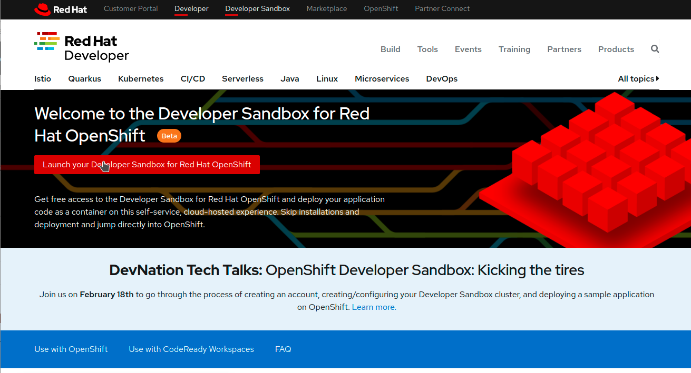
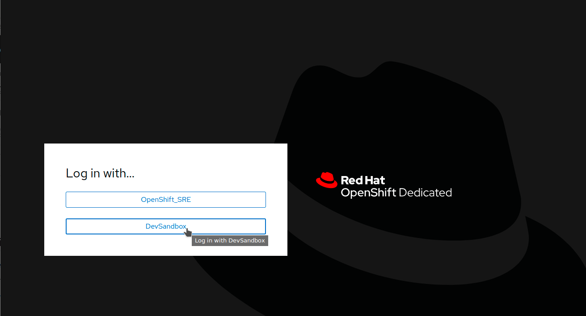
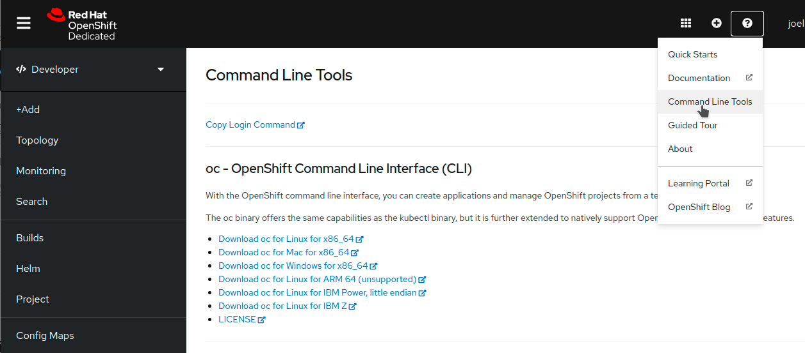
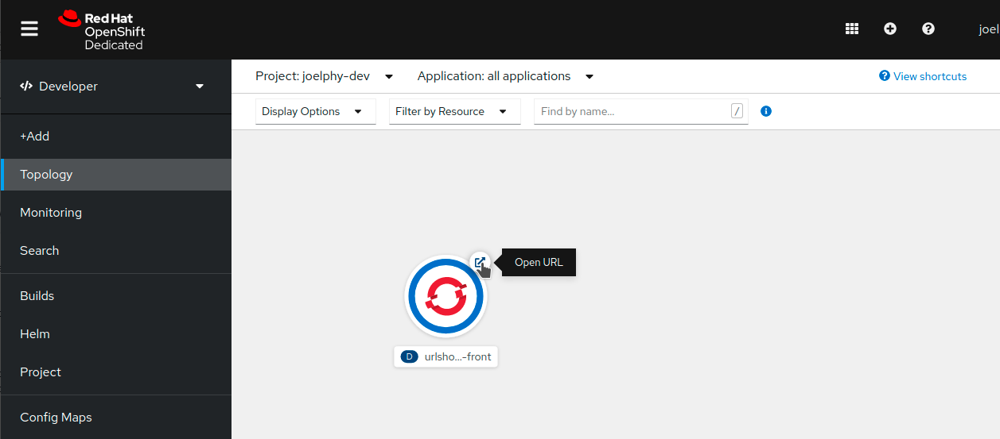
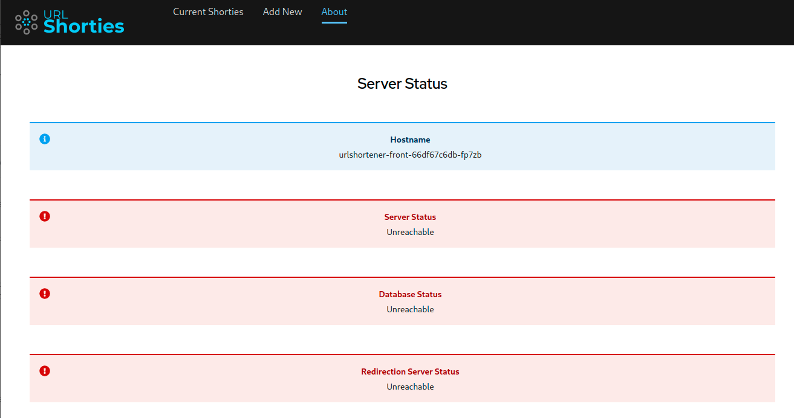

OpenShift is a Kubernetes distribution by Red Hat that aims at making it easy to deploy and scale applications in the cloud. 
In this series of blog posts, you will learn how to deploy a full-stack JavaScript application in an OpenShift cluster. Starting from a source code, you will take an application that runs locally and deploy it in the Developer Sandbox. You can find a full video of this deployment on the DevNation [website](https://developers.redhat.com/devnation/tech-talks/dev-sandbox). This tutorial is in three parts. In this first part, you will learn how to set up your environment and run the application locally. Then, you will build a container for the front end and deploy it to OpenShift. In part two, you will deploy the back-end and connect it to the front-end using environment variables. In the last part, you will see how to deploy a database and connect everything together. You will also see how you can use the UI to deploy an application from an existing container.

## Setup

### Prerequisites

The following CLI tools are required for running the exercises in this tutorial. Please have them installed and configured before you get started with any of the tutorial chapters.

| Tool | macOS | Fedora | windows |
| ---- | ----- | ------ | -------- |
|Git|[Download](https://git-scm.com/download/mac)|[Download](https://git-scm.com/download/linux)|[Download](https://git-scm.com/download/win)
Docker|[Docker for Mac](https://docs.docker.com/docker-for-mac/install)|dnf install docker|[Docker for Windows](https://docs.docker.com/docker-for-windows/install)

### Create a Developer Sandbox Account

The first step to deploy your application is to find a cluster to host it. You could use any OpenShift cluster for this demo, but if you don’t have access to one, you can use the [Developer Sandbox](https://developers.redhat.com/developer-sandbox) to have access to a free OpenShift cluster for 14 days. To create your account, go to [https://developers.redhat.com/developer-sandbox](https://developers.redhat.com/developer-sandbox). From there, click on the red button that says _Launch your Developer Sandbox for Red Hat OpenShift_ as shown in the following image.  Use your existing Red Hat account or create a new one, then follow the instructions on the screen. You should then be redirected to the Developer Sandbox page again, but this time, you should see a button labelled _Start using your sandbox_. Clicking on it opens up the OpenShift login screen where you can log in using the DevSandbox button, as seen below.  Clicking this button opens up your new OpenShift cluster console. Feel free to take the tour or skip it for now and continue with this workshop.

### Configure oc

To interact with your OpenShift cluster, you need the oc CLI tool. Thankfully, the OpenShift team made it easy for you to install it. To get the CLI tool for your operating system, click on the question mark icon at the top right of the OpenShift UI. From this dropdown, select _Command Line Tools_. This option opens up a page with the links required to install the oc tool.  Once the tool is installed, click on the link for _Copy Login Command_ from the same _Command Line Tools_ page. A new window will open up with the authentication screen. Select DevSandbox, then click on the _Display Tokens_ link on the next page. On this new page, you can find a command that starts with oc login. Copy this whole line with the --token and --server parameters and paste it into your terminal.

```bash
oc login --token=sha256~%TOKEN% --server=https://%SERVER%:6443
```

You should get a message back confirming that you successfully logged in to the developer sandbox.

```bash
Logged into "https://%SERVER%:6443" as "%USERNAME%" using the token provided.

You have access to the following projects and can switch between them with 'oc project <projectname>':

 \* %USERNAME%-code
 %USERNAME%-dev
 %USERNAME%-stage

Using project "%USERNAME%-code".
```

### Run the Application Locally

The application that you will deploy to this OpenShift cluster is a URL shortener and redirection service. It has a React front-end to manage your links and connects to a Node.js API. That express server then connects to a Mongo database to store and retrieve the URLs. The is also another application called the "redirector" micro-service that performs a database lookup and redirects the traffic to the matching URL. This service is built in PHP. You need a copy of the source code to build your container images. To do so, you can use git clone.

```bash
git clone https://github.com/joellord/urlshortener
```

Feel free to explore the source code of the application. If you want to run it locally, you can do so with docker-compose or podman-compose.

```bash
docker-compose up
```

This command starts the application in development mode. To view the application, you can open up a browser and point it to [http://localhost:3000](http://localhost:3000/).  

## Deploy the Front-End

**Note:** In this section, you will see how to build a container for the front-end. If you want to skip this part and jump directly to the deployment part, you can also use a pre-existing image by jumping to the section "Deploy the Front-End".

### Build a Container

To deploy this application, you can’t just use the same container that you used in development. That container is for a development environment and includes things such as a hot-reload server. For your production environment, you will package up your React application and deploy it on an Nginx server. Ideally, it will use environment variables to configure it and will run as a non-root user for maximum security. To find out more about building such containers, you can take a look at [this blog post](https://developers.redhat.com/blog/2021/03/04/building-rootless-containers-for-javascript-front-ends/). For this workshop, you will use the templates provided in that post. First, start by copying the Dockerfile, nginx.conf and start-nginx.sh files from the repository mentioned above.

```bash
cd front
curl https://raw.githubusercontent.com/joellord/frontend-containers/main/react-project/Dockerfile.rootless -o Dockerfile
curl https://raw.githubusercontent.com/joellord/frontend-containers/main/react-project/start-nginx.sh -o start-nginx.sh
curl https://raw.githubusercontent.com/joellord/frontend-containers/main/react-project/nginx.conf -o nginx.conf
```

To avoid copying all the node\_modules folder in your container, you can also create a .dockerignore file.

```bash
echo "node\_modules" > .dockerignore
```

You are now ready to build this image.

```bash
docker build -t urlshortener-front .
```

**Note:** If you are using podman instead of docker, you need to use the \--format=docker parameter to push your image to [Docker Hub](https://hub.docker.com/).

### Push to a registry

Now that you have an image ready to be deployed, you can use the docker push command to store this image into a registry. Feel free to use any registry for this step. If you don’t have access to an image registry, you can create a free account on [Quay.io](http://quay.io/) or skip to [the deployment step](https://redhat-scholars.github.io/getting-started-fullstack-js/getting-started-fullstack-js/02-front.html#newapp) and use the publicly available image. Use the CLI tool to push this image to a registry. Make sure that you replace \`%REGISTRY\_USERNAME% with your actual username

```bash
docker push urlshortener-front %REGISTRY\_USERNAME%/urlshortener-front
```

This application image is now available to be used by OpenShift.

### Deploy the front-end

You are now ready to deploy this image in your OpenShift cluster. Using the oc CLI tool, this can be done with a single command.

```bash
oc new-app %REGISTRY\_USERNAME/urlshortener-front
```

If you didn’t push your custom image to a public registry, you could also use this image with the latest version of the URL shortener front-end.

```bash
oc new-app joellord/urlshortener-front
```

**Important:** If you run into an error message about hitting a rate limit, take a look at [this blog post](https://developers.redhat.com/blog/2021/02/18/how-to-work-around-dockers-new-download-rate-limit-on-red-hat-openshift/) for more details on how to work around it.

### Expose the application

OpenShift will now go and download that image from your registry and create a new application with it. The front-end has been deployed to your cluster, but there still isn’t a way to access it from the outside of the cluster. To do so, you need to expose the service created with a Route. This can be done with a single command.

```bash
oc expose svc/urlshortener-front --port=8080
```

Your application is now fully deployed to OpenShift, and you should be able to see it in the Topology view of your application, as shown below. 

### Verify application status

If you click on the "Open URL" button next to your application in the topology view, it should open up your front-end application. From here, you can view the list of redirection URLs (currently empty). You can also see the form to add new URLs (currently non-working). Finally, a third link in the navigation bar leads to an "About" page. In there, you can see the status of the Node.js API, the Mongo database and the redirector service.    Right now, all indicators are red because the front-end doesn’t have a back-end to talk to. This will be addressed in the next post of this series.