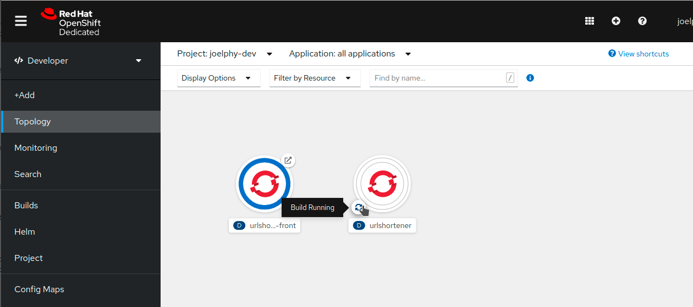
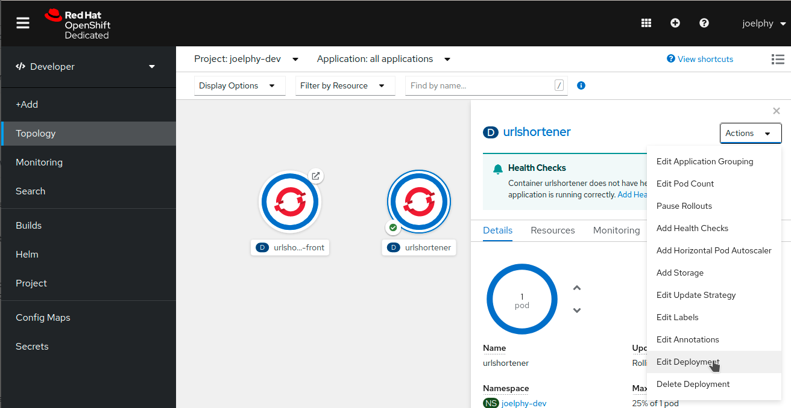
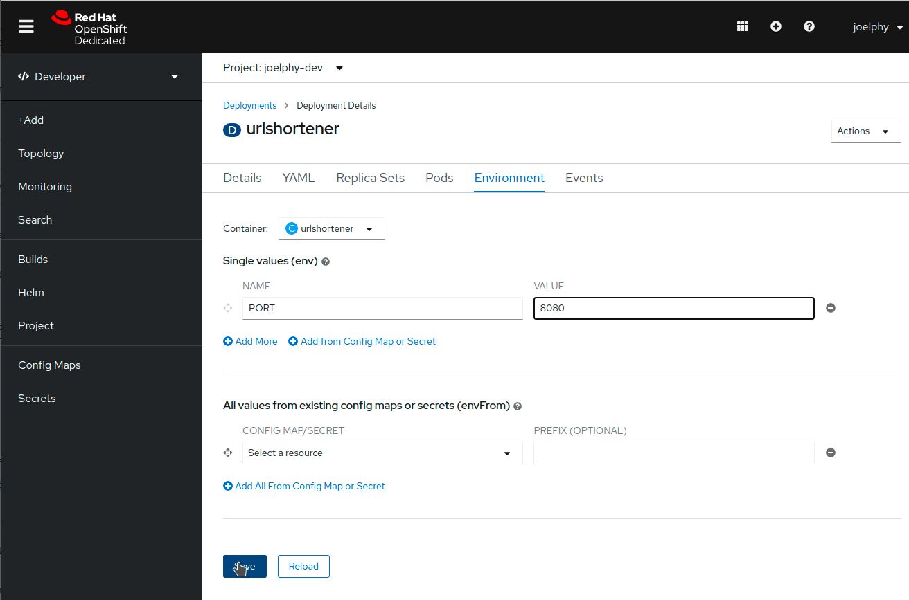
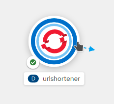
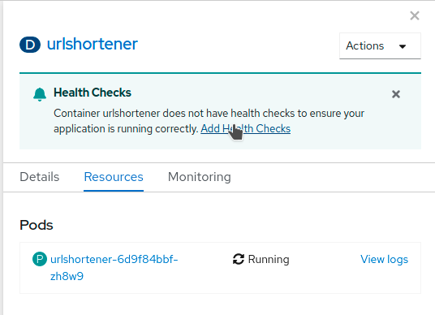
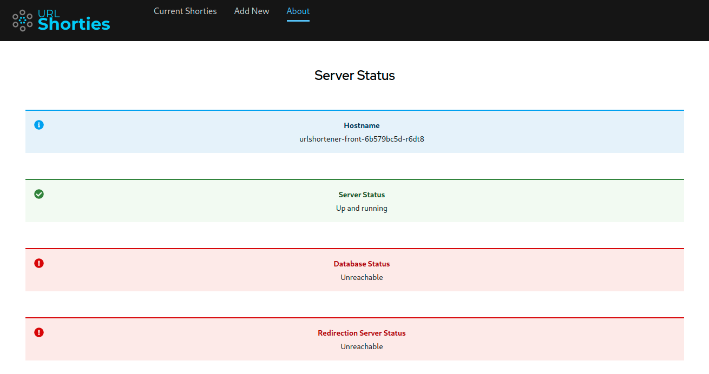

This is a three parts tutorial in which you will learn how to deploy a full-stack JavaScript application in an OpenShift cluster. If you have not completed part 1 yet, you can find it [here](https://javascripteverything.com/blog/post/2021-05-04_fullstack_js_1). In this part, you will learn how to deploy the back-end for your application using s2i and how to connect it to your front-end using environment variables.

## Deploy the Back-End

In the previous section, you created a Dockerfile, built a container and then pushed it to a shared registry so it could be used by OpenShift. When deploying applications to OpenShift, you can use some of the built-in toolings to make it much easier to deploy an application. In this section, you will deploy a Node.js back-end using s2i.

### Use s2i

Source-to-image ([s2i](https://github.com/openshift/source-to-image)) is a toolkit to build containers directly from the source code. To build the Node.js back-end from the Github source code, you can use the oc new-app command you’ve used previously. This time, you must specify a base image from which to build the container (centos7/nodejs-14-centos) and indicate the Github repository in which the source code is located. The --context-dir parameter is there to specify that the source code is located in the /back folder.

```bash
oc new-app quay.io/centos7/nodejs-12-centos7~https://github.com/joellord/urlshortener --context-dir=back
```

You should get a message back indicating that a Build has started.

```bash
--> Found container image 4c29251 (4 days old) from quay.io for "quay.io/centos7/nodejs-12-centos7"
 Node.js 12
 ----------
 Node.js 12 available as container is a base platform for building and running various Node.js 12 applications and frameworks. Node.js is a platform built on Chrome's JavaScript runtime for easily building fast, scalable network applications. Node.js uses an event-driven, non-blocking I/O model that makes it lightweight and efficient, perfect for data-intensive real-time applications that run across distributed devices.
 Tags: builder, nodejs, nodejs12
 \* An image stream tag will be created as "nodejs-12-centos7:latest" that will track the source image
 \* A source build using source code from https://github.com/joellord/urlshortener will be created
 \* The resulting image will be pushed to image stream tag "urlshortener:latest"
 \* Every time "nodejs-12-centos7:latest" changes a new build will be triggered

\--> Creating resources ...
 imagestream.image.openshift.io "nodejs-12-centos7" created
 imagestream.image.openshift.io "urlshortener" created
 buildconfig.build.openshift.io "urlshortener" created
 deployment.apps "urlshortener" created
 service "urlshortener" created

\--> Success
 Build scheduled, use 'oc logs -f bc/urlshortener' to track its progress.
 Application is not exposed. You can expose services to the outside world by executing one or more of the commands below:
 'oc expose svc/urlshortener'
 Run 'oc status' to view your app.
```

If you head to the topology view, you can see that the application is there with a white ring. This ring indicates that the application is currently being built. The source code is cloned, and the image is built directly on the OpenShift cluster.  In a few minutes, you should see the ring turn blue, indicating that the image was successfully deployed.

### Configure environment variables

The Node.js application was running on port 3001 in the development environment, which was set as an environment variable. In the production server, you might want to change some of those environment variables. In this case, you will change the port on which the application is running to 8080. Click on the urlshortener circle, and a side panel will open. In this panel, find the Actions menu in the top right and select _Edit Deployment_.  A YAML editor is then displayed where you can see the description of the urlshortener deployment. In the navigation bar, select Environment. This will open up the Environment variables editor. Add a single value with the name PORT and the value 8080.  Then click save and go back to the topology view. If you go back fast enough, you might see a double ring around the urlshortener application.  This is because OpenShift is currently deploying a new version of the application with the new environment variables. Once it’s up and running, it takes the old one down. This process ensures that there is zero downtime when you update your applications.

### Expose the application

Now that the application was deployed, you can expose it using the same command as you used for the front-end.

```bash
oc expose svc/urlshortener
```

There is no need to specify the port in this case because s2i assumed that the application would be running on port 8080. If you click on the Open URL link, you should see a response back from the server.

```json
{ "msg": "Hello" }
```

You can also try the /health route, which should return the server and database status.

```json
{ "server": true, "database": false }
```

You can see the code for this /health route in the express server [here](https://github.com/joellord/urlshortener/blob/main/back/routes/index.js#L15-L20).

### Add a health check

OpenShift can periodically check your pod to see if it is still running. This is called a health check. In the side panel when you clicked on the urlshortener deployment, you might have noticed a message recommending to add one. Go ahead and click on _Add Health Checks_.  From this next screen, you can add a Liveness Probe that monitors your application by doing periodic calls to the specified route. As long as it returns a 200 HTTP code, OpenShift assumes that the application is still running. To add the health check, click on _Add Liveness Probe_. Change the Path to _/health_ and keep all the other default values. Click on the checkmark at the bottom of the dashed area, and then click on the blue "Add" button to save this health check. If you want to validate that this is working, you can use the _Resources_ tab from the deployment side panel and click on _View logs_ next to the pod name. This screen shows you the pod logs, and you should see the request to /health every 10 seconds.  

## Link the front-end and back-end

Now what the back-end is up and running, you can test out the About page again. If you open up the developer tools and look at the network requests, you can notice that some requests are made to \`%SERVER\_NAME%/$BASE\_URL/health. That is because the front-end currently doesn’t have a value for the $BASE\_URL environment variables. To learn more about how the front-end container injects those variables in the JavaScript code, you can look at [this blog post](https://github.com/joellord/frontend-containers).

## Add the BASE\_URL variable

You can add environment variables using the oc CLI tool, but before you do so, you need to find the BASE\_URL that the front-end needs to connect to. This base URL is the route to your back-end. You can find this route by running the get route command.

```bash
oc get route urlshortener

NAME           HOST/PORT                                                         PATH   SERVICES       PORT       TERMINATION   WILDCARD
urlshortener   urlshortener-joelphy-dev.apps.sandbox.x8i5.p1.openshiftapps.com          urlshortener   8080-tcp                 None
```

If you only want to get the actual route, you can use awk to help you. 

```bash
oc get route urlshortener | awk 'NR>1 {print $2}' 
```

Now that you know how to get the URL, you can set it as an environment variable for the urlshortener-front deployment by using the set env command with oc. Give it the environment variable name and the value of that route. Don’t forget to prepend it with http://.

```bash
oc set env deployment/urlshortener-front BASE\_URL=http://$(oc get route urlshortener | awk 'NR>1 {print $2}')
deployment.apps/urlshortener-front updated
```

### Test the application

Now that you have configured the BASE\_URL environment variable, you can go back to the URL Shortener application and check the About page again.  You can see that the server is now up and running. The database and redirector services are still unreachable because you have not deployed them yet. Those will be added in the third and final part of this series.