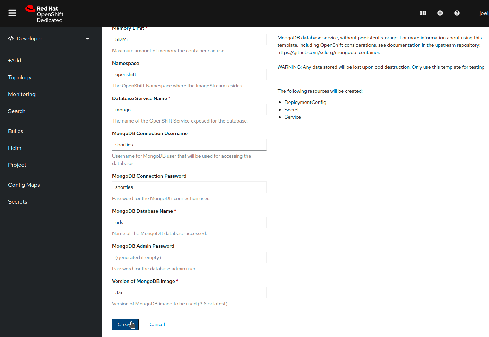
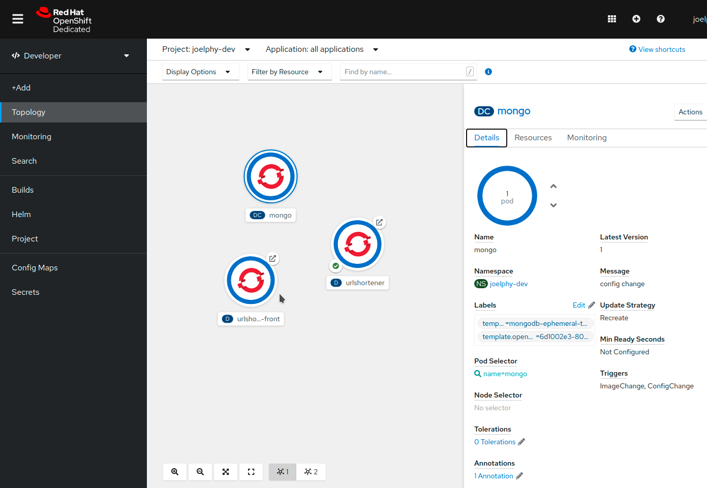
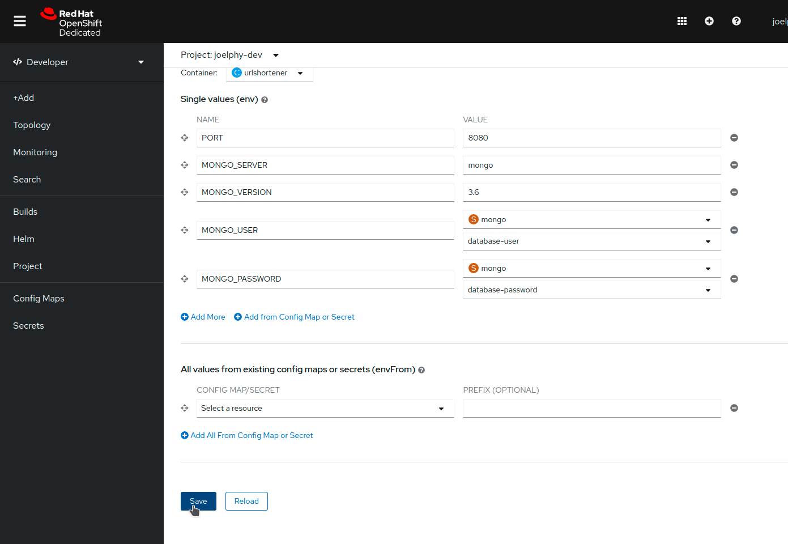
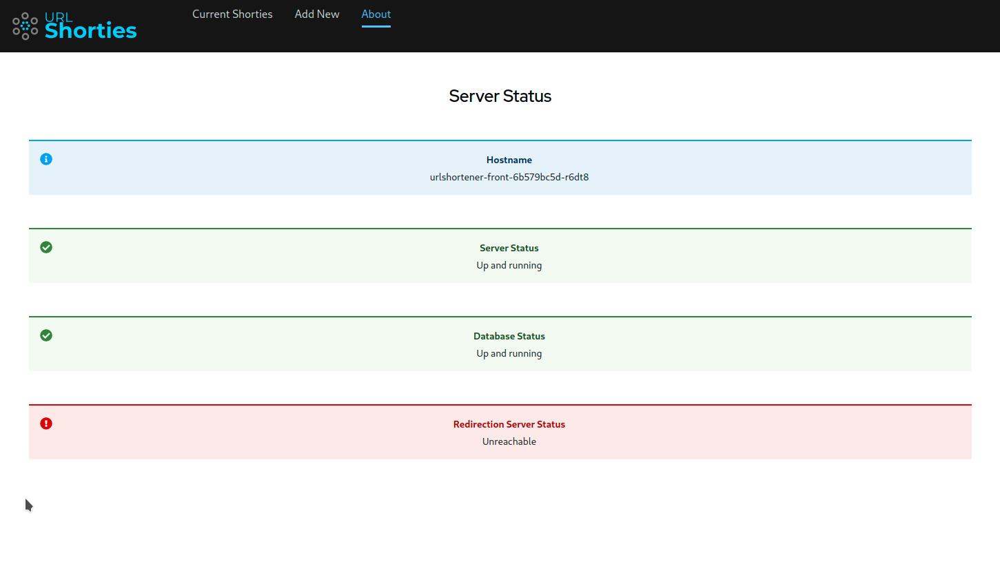
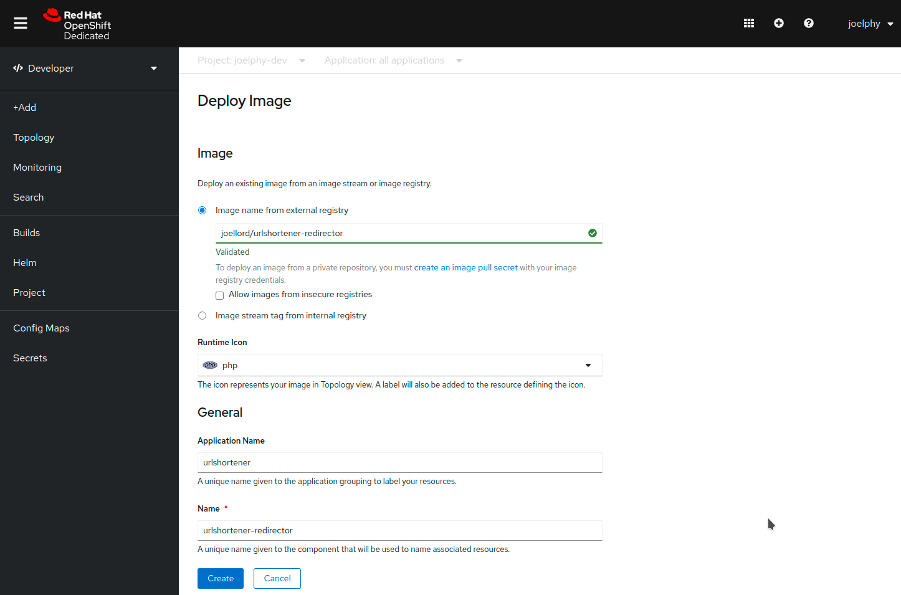
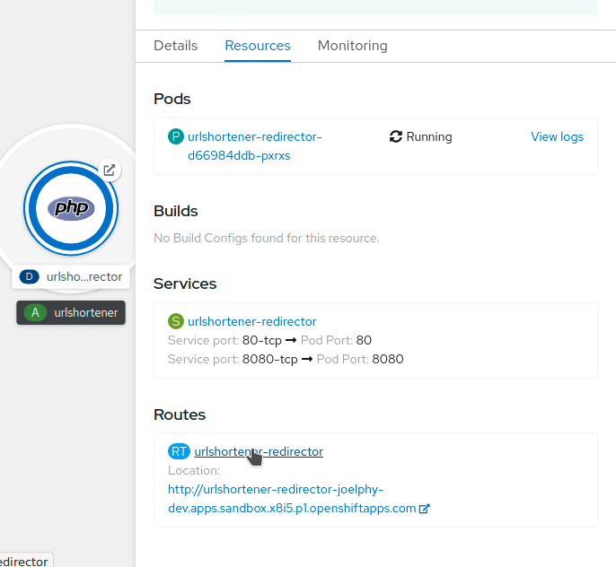
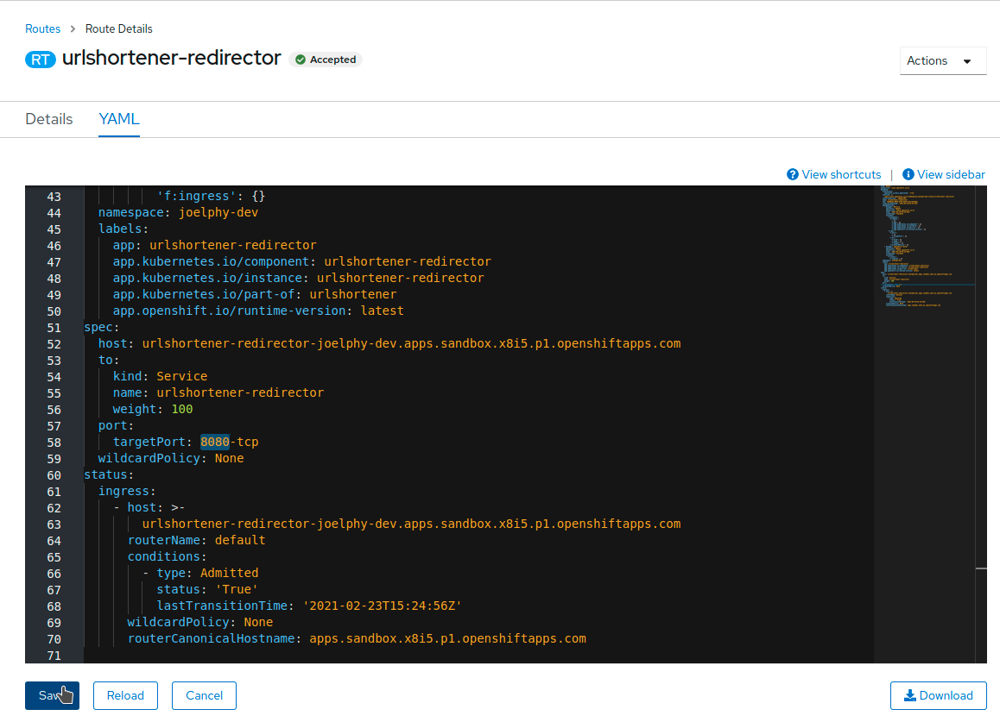
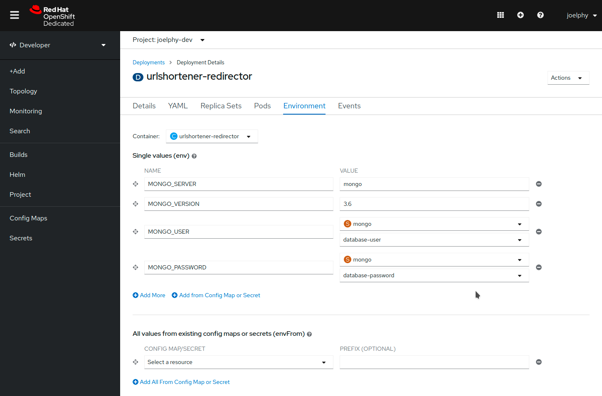
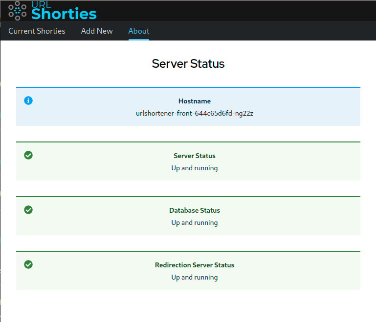

This is a three parts tutorial in which you will learn how to deploy a full-stack JavaScript application in an OpenShift cluster. You can find part 1 [here](https://javascripteverything.com/blog/post/2021-05-04_fullstack_js_1) and part 2 [here](https://javascripteverything.com/blog/post/2021-05-04_fullstack_js_2). In this final post of the series, you will learn how to add a database to your project using the developer catalog. You will also see how to deploy another microservice to your application by using a pre-built image and the OpenShift developer console UI.

## Add a Database

You now need to add a database to your application so you can store those links somewhere. In the last sections, you saw how to create your container and deploy it and use s2i to build a container to be deployed. This time, we will use the application catalogue and pick a template to deploy on the cluster.

## Deploy from the catalogue

From the left navigation bar, click on _+Add_. This brings up a menu with various options to add your application to the OpenShift cluster. Choose "Database" to open up the developer catalogue filtered out for database templates. From this view, select the MongoDB (Ephemeral) card. A side panel should open. On this panel, click on the blue _Instantiate Template_ button. 

**Note:** This is an ephemeral template for MongoDB. When the pod restarts, all data is lost. This is ideal for development purposes but not so great for production. In the case of a production deployment, you will want to look into operator-backed templates.

On the next screen, fill in the fields with the following values: 
* Database Service Name: mongo 
* MongoDB Connection Username: shorties 
* MongoDB Connection Password: shorties 
* MongoDB Database Name: urls 

Then click on the blue "Create" button at the bottom.  

OpenShift is now creating all the necessary components to deploy this database to your cluster. In a few seconds, you should see the application in the topology view with a blue ring indicating that it is running. 

### Use the UI to configure env variables

Now that the database started, it is time to configure the back-end to connect to it. In the last section, you used the CLI to configure the environment variables. This time, you can stay in the comfort of the UI. Click on the urlshortener deployment from the topology view. This will open up a side panel. In the Actions menu on the top right, select _Edit Deployment_. From this new screen, select the _Environment_ tab, and you should be back to the screen where you added the PORT earlier. Click on "Add More" to add the following environment variables.

*   MONGO\_SERVER: mongo
*   MONGO\_VERSION: 3.6

For the user name and password, you can also use the Secret created by the MongoDB template. Click on _Add from Config Map or Secret_, and use the name MONGO\_USER. In the _Select a resource_ dropdown, pick the Secret named mongo. In the _Select a key_ dropdown, pick database-user. Do the same for MONGO\_PASSWORD, which maps to the database-password key. Once you are done, click on the blue "Save" button at the bottom of the page. 

### Verify the application status

Now that the database component has been added and the back-end is configured, it’s time to test the application again. If you open up the front-end and look at the About page, you should now see that the database is up and running.  

You can now use the _Add New_ page to create URL shortcuts, and you can see them on the "Current Shorties" page. All of this data is persisted if you refresh the page. When clicking on the link icon, though, you get an error. This error is because the front-end is trying to contact a redirector service that hasn’t been deployed yet. This service will be added in the next section.  

## Add a new micro-service

You now have a front-end, an API and a database deployed and running on OpenShift. This application needs another micro-service that short URLs will point to and will redirect to the matching longer URL found in the database. One of the many benefits of deploying containerized micro-services is that they don’t need to be written in the same language. In this example, you will see how to add a PHP server to this application.

## Add from existing image

The image containing the service is already built for you. If you are curious, you can find the source code and Dockerfile in the [/redirector](https://github.com/joellord/urlshortener/tree/main/redirector) folder of the source code. You can add this image by using the same commands as in the first section of this workshop, or you can use the UI to do the same thing. To do so, click on the _Add+_ link in the left navigation bar of the console. Next, choose the _Container Image_ card. A new page titled _Deploy Image_ will be displayed. In the field _Image name from external registry_, enter joellord/urlshortener-redirector. Optionally, you can change the _Runtime Icon_. Since this is a PHP application, I like to use the matching icon. For the _Application Name_, remove the redirector-app to keep urlshortener. This will create a group in the topology view and you will be able to add the other services to it. Everything else can use the default values. Click on the blue "Create" button when you are ready.  

The application should have been successfully deployed, but the route won’t work for now. Because this image has two different exposed ports, the created route was mapped to the wrong port. To change this, you can click on the urlshortner-redirector application in the topology view. In the "Resources" tab from the side panel, click on the route name.  

From the _Actions_ dropdown, choose _Edit Route_. This opens up a YAML editor. Scroll down to find the "spec" object (they are in alphabetical order). Then look for the "port" property. In here, the targetPort has the value "80-tcp". Change that to "8080-tcp" and click _Save_.  

You can now go back to the Topology view and click on the Open URL link for the urlshortener-redirector application. This will show a page with a few errors. The PHP application doesn’t have environment variables yet, so it can’t connect to the database for now.

### Update Environment Variables

For the redirector service to connect to the Mongo database, it needs a few environment variables. Click on the application, and from the _Action_ dropdown in the side panel, choose _Edit Deployment_. Choose the _Environment_ tab and fill in the following values:

*   MONGO\_SERVER: mongo
*   MONGO\_VERSION: 3.6
*   MONGO\_USER from mongo Secret: database-user
*   MONGO\_PASSWORD from mongo Secret: database-password

 

Then click Save, and the urlshortener-redirector application will restart with these new environment variables. Now that the service is configured and ready to go, update the REDIRECTOR\_URL environment variable from the front-end to point to this service.

```bash
oc set env deployment/urlshortener-front REDIRECTOR\_URL=http://$(oc get route urlshortener-redirector | awk 'NR>1 {print $2}')
deployment.apps/urlshortener-front updated
```
The front-end pod will restart with the new environment variables.

### Verify the status of the application

Now that you have everything up and running, open up the application _About_ page again. You should see all systems green.  

You can now use the application. 

Congratulations! You’ve deployed a full JavaScript application into an OpenShift cluster. Now that you have an application in the developer sandbox, you can try various things such as scaling up some of the applications, grouping the applications in the topology view and looking at the logs inside the pods. To learn more about OpenShift, you can try out some of the smaller workshops at [http://learn.openshift.com](http://learn.openshift.com/).