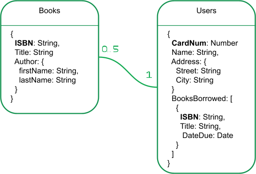
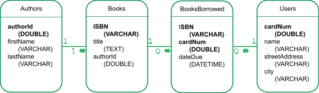

Why is having a good data model essential from the start of your project? Any modern application needs data to run, but how you model your data will have a drastic impact on the performance of your application, as well as the speed of development. In this article, you will learn what data models are, why you need them, and how to create a data model to be used with MongoDB.

## What are data models?
A data model is a visual representation of how you will store data, along with how the data is related to each other. The goal of creating a data model is to identify all the data components of a system and how they are linked together.

The fact that MongoDB has a [flexible schema](https://docs.mongodb.com/manual/core/data-modeling-introduction/#flexible-schema) doesn’t mean that you don’t need data modeling or schema design. Instead, a good data model means that you will establish a strong foundation for an ever-evolving data model that will adapt as your requirements change. By creating a solid data model right from the start, you can ensure that your application will perform better and be more future-proof.

## What are data models used for?
A data model provides you with the foundation for the data structure of your application. Creating the data model can help you to identify the business rules that your application will need to follow. The data model will also provide your development team with a consistent map of the data used by the application they are developing.

Thinking ahead of time about how you will access the information from the application will help you plan better. It will also help you understand the business processes that are sometimes hidden or not explicitly explained by your stakeholders.

While data modeling might seem like an additional step in the development planning cycle, it can make the development cycles much faster.

## What are the (three) different types of data models?
As you start modeling your data, you will likely go through various steps of data analysis. Each step might produce different types of data models. Therefore, data models can be generally thought of as being one of the three following types.

* Conceptual Data Model: The conceptual data model explains what the system should contain with regard to data and how it is related. This model is usually built with the help of the stakeholders. It represents the application’s business logic and is often used as the basis for one or more of the following models.
* Logical Data Model: The logical data model will describe how the data will be structured. In this model, the relationship between the entities is established at a high level. You will also list the attributes for the entities represented in the model.
* Physical Data Model: The physical data model represents how the data will be stored in a specific database management system (DBMS). With this model, you would establish your primary and secondary keys in a relational database or decide whether to [embed](https://www.mongodb.com/basics/embedded-mongodb) or link your data in a document database such as MongoDB. You will also establish the data types for each of your fields. This will provide you with your database schema.

These models are created using entity-relationship diagrams (ERD). An example of these three models can be found in the section titled What is an example of a data model? below.

## What is the data modeling process?
You can think of data modeling as a series of steps, each one providing you with one of the models described above.

The first step to a data modeling process is to gather all the requirements for your application. This step will provide you with the underlying data structure that you will need to review. Analyze not only the data objects, but also the size of the data and the operations that will be performed on that data. This step will be done with the help of domain experts. At the end of this first step, you should have the necessary information to draft your conceptual data model.

The next step is to understand the relationship between the various entities that make up your whole data model. Try to think about how the objects would be related and the attributes you would use to describe these objects. This step will provide you with your logical data model. Finally, you can start thinking about the actual data that you will store in the database. At this point, you will try to identify unique keys and field types. The way you model your data will depend highly on the type of DBMS you will be using. If you are using a relational database, you might start thinking about normalizing your data while you would think about embedding related information in a document database. At the end of this step, you can produce a physical data model representing your initial database.

## What is an example of a data model?
Let’s imagine a scenario where you would build an application for the users of a library. How would you model this database?

First, you will speak with the business analysts to understand the entities that need to be part of your system. You’ll find out that these must be included:

* Books: The library has millions of books, and they all have a unique International Standard Book Number (ISBN). The users will need to search books by title or by author.
* Users: This library has thousands of users, and each user has a name, along with an address. The library will assign them a unique number that they can find on their library card.

You will also need to understand how the various entities will interact with each other. These interactions will give you the relationships in your model. In the case of the library example, interactions might look like:

* Users will borrow books: Ultimately, the library will need to know which books have been borrowed by which user. Each user is entitled to five borrowed books at a time.

These business rules will let you organize the information to build your conceptual model. By now, you understand the data necessary to build the first iteration of your software.

_Figure 1: The conceptual model_

It is now time to create a logical data model. As part of this modeling step, you might realize that some of your data structures are more complex and require new entities. For example, the authors would be better represented as their own entities in order to enable searching for books by authors. We are assuming here that there is a single author per book for the sake of simplicity.

The relationships between the various objects that form the data model also start to emerge from this model.

_Figure 2: The logical model_

It is now time to choose your DBMS and build your physical data model. At this point, you will start thinking in terms of the database you picked. The type of database you choose will determine how you will store the data.

If you use a document database, such as MongoDB, you will model relationships using [embedding](https://www.mongodb.com/basics/embedded-mongodb) or [document references](https://docs.mongodb.com/manual/tutorial/model-referenced-one-to-many-relationships-between-documents/). As you establish the relationships between your various objects, you will also find your IDs and unique values representing your items.

Let’s return to our library example. In the following diagram, you can see that the author was embedded in the books. This will make it easier to create indexes to enable the full-text search capabilities of [MongoDB Atlas Search](https://www.mongodb.com/atlas/search). The books borrowed are listed as an array in the user document because this information will be generally retrieved all at once on the application’s main page. A different use case with this same library data might have called for a [different](https://docs.mongodb.com/manual/tutorial/model-embedded-one-to-many-relationships-between-documents/) physical data model. The ISBN and CardNum fields are unique for the documents and could be used as the ID field. You could also use them as a [sharding](https://www.mongodb.com/basics/sharding) key if you need to scale to multiple clusters.

_Figure 3: The physical data model for a document database_

If you decide to go with a traditional relational database, the physical data model will look very different. In this example, the authors and books table are linked through a one-to-many relationship. The authorId field is the primary key in the authors’ table, and the authorId field would be the foreign key in the books table. A joint table is added to keep track of the borrowed books along with the due dates.

_Figure 4: The physical data model for a relational database_

Now that you’ve been through these stages, you have an entire database model that describes how to store your entities and create relationships amongst them. Those steps also gave you some insights into what should be your keys and your indexes.

## What data modeling tools are available?
The example above was simple enough to be represented by a simple drawing tool. As your data models get more complex, you might need to rely on more advanced tooling to represent the data you are trying to map.

* Hackolade is a general purpose tool that can help you create visual representations of your data for relational or document databases. It can even be used to [create your MongoDB schemas](https://www.mongodb.com/blog/post/optimize-data-modeling-and-schema-design-with-hackolade-and-mongodb) and get you up and running faster.

* If you are looking for a free and open-source tool, you can look at [Open ModelSphere](http://www.modelsphere.com/org/index.html), a powerful software that lets you create just about any possible model.

* If a collaborative design is more important, consider [Creately](https://creately.com/), a general design tool that lets you work in real time with other contributors on your models.

All of these tools use standard universal markup language (UML) to build your ERDs and will provide you with professional-looking diagrams that can then be shared with your team.

## Flexible data modeling with MongoDB Atlas
MongoDB provides you with a [flexible schema](https://docs.mongodb.com/manual/core/data-modeling-introduction/#flexible-schema) for your data. This flexible schema means that you can easily change your data structure as your application progresses and the requirements change. This doesn’t mean that you shouldn’t think about data modeling, though. A good data model will help you understand the business requirements for your application and structure your schema to optimize your queries.

As you model your data, think about how the data will be displayed and used in your application. The way you use the data should dictate the structure of your database, and not the other way around. This is why MongoDB is easier to use for software developers. Try it out for yourself with [MongoDB Atlas](https://www.mongodb.com/cloud/atlas), MongoDB's fully managed database-as-a-service (DBaaS).

Next steps
Now that you know how to model your data, you can create a MongoDB Atlas cluster and build your database. You can find out more about data modeling from the [Data Modeling with MongoDB](https://www.mongodb.com/presentations/data-modeling-with-mongodb) presentation from [MongoDB.live](https://www.mongodb.com/live) 2020. There is also a course available on that specific topic at [MongoDB University](https://university.mongodb.com/courses/M320/about).

A good data analysis phase will help you plan out how you should structure your data. It will also help you identify what your indexes should be, leading to an overall better application. Once you are familiar with data modeling for MongoDB, you will also need to understand how to create good [data schemas](https://developer.mongodb.com/article/schema-design-anti-pattern-summary/) and apply [patterns](https://www.mongodb.com/blog/post/building-with-patterns-a-summary) to make your database even more efficient. Once you master those skills, you will be able to create applications that are faster and more scalable.