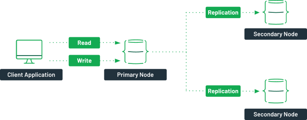
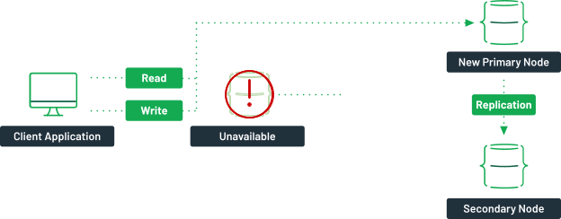
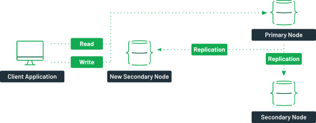

As a modern database, MongoDB was initially built with the cloud in mind and now has built-in features to help maintain a high availability and easy scalability through distributed workloads. While it’s true that it can run as a single instance, most of the time it runs as a cluster. In this article, you will learn about the different types of clusters in MongoDB and how you can set them up in MongoDB Atlas.

## What is a MongoDB Cluster?
In MongoDB, [clusters](https://www.mongodb.com/basics/clusters) can refer to two different architectures. They can either mean a [replica set](https://www.mongodb.com/basics/replication) or a [sharded cluster](https://www.mongodb.com/basics/sharding). Let’s take a closer look at both.

### Replica Sets
A MongoDB replica set is a group of one or more servers containing the exact copy of the data. While it’s technically possible to have one or two nodes, the recommended minimum is three. A primary node is responsible for providing your application’s read and write operations, while two secondary nodes contain a replica of the data.

_A typical replica set in MongoDB._

Should the primary node become unavailable for some reason, a new primary node would be picked by an election process. This new primary node is now responsible for the read and write operations.

_If a primary node is unavailable, the traffic from the client application is redirected to a new primary node._

Once the faulty server comes back online, it will sync up with the primary node and become a new secondary node in the cluster.

_When the previous primary node comes back online, it comes back as a secondary node._

The goal is to provide your application with high availability over your data. Even in a server failure, your client application can still connect to the cluster and access the data, reducing the overall potential downtime.

### Sharded Clusters
A sharded cluster is a way to scale horizontally by distributing your data across multiple replica sets. When a read or write operation is performed on a collection, the client sends the request to a router (mongos). The router will then validate which shard the data is stored in via the configuration server and send the requests to the specific cluster.

_A typical sharded cluster in MongoDB._

Each of the shards would contain its own replica set. You should also have more than one router or configuration server to ensure high availability. With this type of architecture, you can scale your database as much as you want without compromising availability or worrying about storage capacity.

## Creating a MongoDB Cluster
Depending on your needs, there are multiple ways to create a MongoDB cluster. The easiest way is using [Atlas](https://www.mongodb.com/cloud/atlas), the Database-as-a-Service platform by MongoDB. You can find detailed instructions in the [documentation](https://docs.atlas.mongodb.com/getting-started/). If you need to run MongoDB on your infrastructure, the instructions are provided later in this article.

To create a MongoDB cluster in Atlas, follow these steps.

* Log in to your MongoDB Atlas account at [https://cloud.mongodb.com](https://cloud.mongodb.com).
* Click on the “Create” button.
* Choose your cluster type (dedicated, serverless, shared).
* Choose your cloud provider and region.
* Click on “Create cluster.”

Your MongoDB cluster will start its provisioning and will be available to you in a few minutes. As you create your cluster, you will see many options to accommodate your specific needs. Each of those setup options is covered in the next section.

## Setting Up a MongoDB Cluster on Atlas
Every application is different, and MongoDB Atlas provides you with numerous ways to set up your cluster to suit your specific needs. Some particular configurations need to be thought of ahead of time, while you can change others on the fly. Using these settings, you will put in place all the [best practices](https://docs.atlas.mongodb.com/best-practices/) for Atlas in production. In this section, you will learn more about the various configurations that you can adjust on your initial cluster creation.

### Deployment Type
The deployment type is the first option you will need to pick. Based on what you decide for the type of instance, the other configuration options will vary.

* Serverless: This type of cluster is the most flexible one from a pricing point of view. It’s meant for applications that have infrequent or variable traffic. The possible configurations are kept at the bare minimum.
* Dedicated: A dedicated cluster is meant for production loads. It can support a wide range of server sizes as well as advanced configurations. You should choose this for your production environment.
* Shared: These clusters are meant to be a way to explore MongoDB. They can provide you with a sandbox where you can try out MongoDB for free. The server configurations available are somewhat limited.
You can find more information about the different database deployment types in the [documentation](https://docs.atlas.mongodb.com/choose-database-deployment-type/).

### Global Cluster Configuration
If you need multiple sharded clusters with read and write operations in specific locations, you will need to enable [Global Cluster Configuration](https://docs.atlas.mongodb.com/global-clusters/). From here, you can choose exactly where you want each of your clusters and configure the mappings between the user country and the server they will use to access the data.

### Cloud Provider and Region
No matter which deployment type you picked, you will need to choose the cloud provider, along with the specific region in which you want to deploy your cluster. You can instantiate MongoDB clusters on any of the three major cloud providers. If you want to ensure even better availability, you can deploy each node of your cluster on different regions or even different clouds. To do so, you will need to enable the [Multi-Cloud, Multi-Region & Workload Isolation](https://docs.atlas.mongodb.com/cluster-config/multi-cloud-distribution/) option. From here, you will be able to configure the number and [types of nodes](https://docs.atlas.mongodb.com/cluster-config/multi-cloud-distribution/) (electable, read-only, or analytical) that will be part of your replica set.

### Cluster Tier
Now that you’ve picked a region and cloud provider, you will need to choose which tier you want to use for the nodes in your cluster. This configuration will have the most significant impact on the pricing of your cluster. There is a wide range of options available, and you can further tweak each of them. Take into consideration the amount of CPU and RAM you will need. Your resource needs will help you find the right tier for your cluster.

You can then further tweak the cluster configuration by adjusting the storage size, toggling the auto-scaling options and the IOPS that you will need. On AWS higher tiers (M40+), you will also be able to choose the class of servers (low-CPU, general, or local NVMe SSD), which will also impact the number of CPUs, RAM, and storage capacity.

### Additional Settings
In this last tab, you will find many additional services that you can add to your cluster. The first option is the [MongoDB version](https://www.mongodb.com/evolved) that you want to use for MongoDB. You will then also have the option to enable or disable the [automatic backups](https://www.mongodb.com/basics/backup-and-restore). You can also expand the additional settings, which will provide you with more advanced options such as [sharding your cluster](https://docs.atlas.mongodb.com/cluster-config/sharded-cluster/), adding the [BI connector](https://docs.mongodb.com/bi-connector/current/), and managing your [encryption keys](https://docs.mongodb.com/manual/core/security-client-side-encryption-key-management/).

Most of the settings you set can be changed on demand in the future, which is a powerful ability as your application evolves.

## Creating a MongoDB Cluster in Different Environments
If a cloud-based instance of MongoDB is not an option for you, or if you need to run a cluster on your infrastructure, you can install MongoDB on supported [operating systems](https://docs.mongodb.com/manual/administration/production-notes/). In addition to MongoDB itself, installing [Ops Manager](https://www.mongodb.com/products/ops-manager) or [Cloud Manager](https://www.mongodb.com/cloud/cloud-manager) is recommended to manage your clusters.

### Create a MongoDB Cluster in Linux (Ubuntu, CoreOS)
To create a MongoDB cluster in Linux, you will need three instances of MongoDB running. These instances need to be able to communicate with each other on a local network.

You can find the detailed instructions to set up your cluster in Linux in the [documentation](https://docs.mongodb.com/manual/tutorial/convert-standalone-to-replica-set/).

### Create a MongoDB Cluster with Docker
If you want to install a local instance of MongoDB in your environment or set up an ephemeral development environment that you can share with your teammates, you might want to use Docker. You can do so by starting three local instances of MongoDB in Docker, then following the instructions in the [documentation](https://docs.mongodb.com/manual/tutorial/convert-standalone-to-replica-set/).

## Next Steps
Now that you know how to create and set up your cluster, you might want to learn more about finding the right cluster topology for your needs. Why not continue your learning with the [cluster setup topology](https://university.mongodb.com/videos/y/ZyDNnN8-4Ak) video on MongoDB University? Once you are comfortable with all the possible configurations for your MongoDB cluster, you can [try MongoDB Atlas](https://mongodb.com/try) for free. With your cluster set up as you see fit, you can now ensure that your data will be made available to your users and that you will be able to scale once you need to.