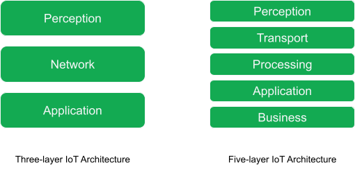
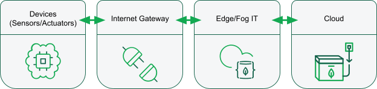
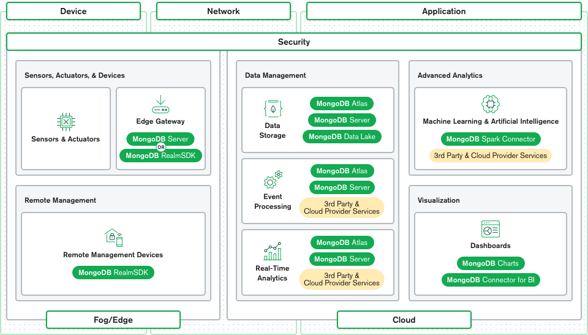

The Internet of Things (IoT) is part of our lives in many ways, much more than we tend to think about. It helps to make our lives easier and more comfortable. In enterprises, it helps to automate processes and make entire industries safer and more efficient. However, there are many considerations to take into account when planning an [IoT solution](https://www.mongodb.com/use-cases/internet-of-things). In this article, you will learn what IoT architecture is and how [MongoDB Atlas](https://www.mongodb.com/cloud/atlas) can be your partner in creating your IoT solution.

## What is IoT?
IoT is a concept that refers to all the objects that are now connected to the internet and how they can communicate with each other or with the people around them. At first, when thinking about IoT, most people think of wireless sensors or smart home gadgets that are connected to the internet. In reality, IoT is a lot more than that. It’s mostly about large data and how this data is being processed and communicated across networks.

Billions of devices are now connected and they produce trillions of bytes of data daily. Having the right architecture will help with managing this incredible volume of data.

## What is IoT architecture?
Due to the ever-evolving nature of IoT devices, and the wide diversity of sensors, there is no one-size-fits-all architecture for [IoT projects](https://www.mongodb.com/collateral/iot-reference-architecture). However, some of the building blocks will be similar from project to project.

First, you will need to build with scalability in mind. The amount of data that you will collect over time will take on enormous proportions and you will need a platform that can accommodate this in the long run.

You will also need to ensure that you have high availability at any given time. Having system failures could make you lose some business in the best case, or could have fatal consequences in the worst cases.

Finally, you will need a system that is flexible enough to accommodate quick and frequent changes. As your architecture evolves, or your business needs change, you will need to iterate quickly without breaking the existing architecture.

These requirements make MongoDB a perfect choice for handling and storing the data in your [advanced IoT architecture](https://www.mongodb.com/presentations/mongo-db-connect-unlock-new-revenue-streams-with-advanced-io-t-architecture). With a MongoDB cluster, your [replica sets](https://www.mongodb.com/basics/replication) will ensure that your servers are highly available. The [sharding](https://www.mongodb.com/basics/sharding) capabilities of MongoDB are also key to easily scaling your application as you need it. Additionally, the [flexible data schemas](https://docs.mongodb.com/manual/core/data-modeling-introduction/) are great to store evolving data.

## What are the three major layers of IoT architecture?
While it is true that no two IoT projects are the same, the main layers have always stayed consistent. Ever since the first research on IoT was done, the three-layer architecture has been the dominant model for IoT applications. The three layers are Perception (or Devices), Network, and Application.

* Perception: The sensors themselves are on this layer. This is where the data comes from. The data could be gathered from any number of sensors on the connected device. Actuators, which act on their environment, are also at this layer of the architecture.

* Network: The network layer describes how large amounts of data are moving throughout the application. This layer connects the various devices and sends the data to the appropriate back-end services.

* Application: The application layer is what the users see. This could be an application to control a device in a smart-home ecosystem, or a dashboard showing the status of the devices which are part of a system.

## What are the five additional layers of IoT architecture?
The three-layer architecture is a great way to describe an IoT project, but it is somewhat limited in scope. For this reason, many proposed architectures have different or additional layers. A popular one is called the five-layer architecture, which includes Transport (replacing the Network), Processing, and Business layers, in addition to the Perception and Application layers from the three-layer architecture model.

In addition to the Perception and Application layers, which are the same, you will usually see the following three layers.

* Transport: This layer describes the transfer of data between the sensors in the Perception layer and the Processing layer through various networks.
* Processing: Sometimes referred to as the Middleware layer, this one stores, analyzes, and pre-processes the data coming from the Transport layer. In modern software applications, this is often located on the edge of the cloud for low latency communications.
* Business: This layer is often referred to as the Business Intelligence layer. Located at a higher level than the Application layer, the Business layer describes everything that has to do with the stakeholders. Decision-making will be done here based on the data found and consumed at the Application layer.

## What are the four main stages of IoT architecture?
Another way to describe an IoT solution architecture is using a four-stage approach. This architecture describes the various building blocks that constitute the IoT solution. In this scenario, more emphasis is put on edge computing than the other proposed designs.

* Devices: This stage is about the actual devices in the IoT solutions. These devices could be sensors or actuators in the Perception layer. Those devices will generate data (in the case of sensors) or act on their environment (in the case of actuators). The data produced is converted in a digital form and transmitted to the internet gateway stage. Unless a critical decision must be made, the data is typically sent in a raw state to the next stage due to the limited resources of the devices themselves.
* Internet gateways: The internet gateway stage will receive the raw data from the devices and pre-process it before sending it to the cloud. This internet gateway could be physically attached to the device or a stand-alone device that could communicate with sensors over low power networks and relay the data to the internet.
* Edge or fog computing: In order to process data as quickly as possible, you might want to send your data to the edge of the cloud. This will let you analyze the data quickly and identify if something requires immediate attention. This layer typically would only be concerned with recent data that is required for time-critical operations. Some pre-processing might be done at this stage, too, to limit the data that is ultimately transferred to the cloud.
* Cloud or data center: In this final stage, the data is stored for later processing. The application and business layers live in this stage, where dashboards or management software can be fed through the data stored in the cloud. Deep analysis or resource-intensive operations such as machine learning training will happen at this stage.

## IoT architecture in business
IoT use cases are varied and can take multiple shapes. In order to understand the different layers, we can look at an example. Commercial airlines have many planes, and each of the planes has a plethora of sensors.

The Perception layer consists of all those sensors in the plane. Those will indicate the current state of the aircraft, along with the data about the current flight. The sensors will monitor things such as the altitude, the position, the airspeed, and the vertical speed. Other sensors are gathering data to ensure that the integrity of the plane is good, monitoring feedback such as vibrations in the engines.

This data, coming from multiple different sensors from different manufacturers, will be sent to a central unit on the plane as part of the Network layer. This data will be converted into a standard format and will be pre-processed there. If something critical happens, such as an engine failure, actuators will be immediately triggered, rather than waiting for a full round trip to the cloud. Once the plane has internet connectivity, the data will be sent to the cloud and move to the Application layer.

Now that the data made its way to the cloud, the data can be processed and analyzed in the Application layer. Here, dashboards are produced to verify anomalies, flag issues for maintenance, and provide business insights for the airline operator. With this data, the operator can make better decisions and automate some tasks in order to make the flights safer. Many industries benefit from IoT solutions. For a more detailed use case, you can watch the presentation [Architecting IoT Solutions for Oil and Gas with MongoDB](https://www.mongodb.com/presentations/thank-you-architecting-iot-solutions-for-oil-and-gas-with-mongodb).

## IoT architecture in MongoDB Atlas
The key to a successful IoT architecture is to find the right way to handle this large amount of data produced by the Perception layer. MongoDB Atlas, the Database-as-a-Service offering from MongoDB, provides you with a collection of tools that can be used at the various layers of your [IoT solution](https://www.mongodb.com/presentations/mongodb-and-the-internet-of-things).

At the Perception layer, you can use MongoDB Server and MongoDB [RealmSDK](https://www.mongodb.com/realm) to store data and provide an interface for the mobile devices of your users.

Once the data leaves the device and heads into the Network layer, MongoDB Atlas can provide you with many ways to configure your servers to achieve proximity with your devices. You can even deploy MongoDB on the edge with [MongoDB data locality](https://docs.mongodb.com/manual/tutorial/sharding-segmenting-data-by-location/) and [workload isolation](https://docs.mongodb.com/manual/core/workload-isolation/) features enabled on your edge cluster. You can use [MongoDB 5.0 Time-Series](https://www.mongodb.com/time-series) native support to store your data in collections that are perfectly suited for IoT applications since they are optimized to gather measurements over time from various sources. You might also need to plan for bad network connectivity. MongoDB Realm can help you with this by providing you with [offline-first syncing](https://www.mongodb.com/realm/mobile/sync) capabilities.

For your Application layer, MongoDB also provides you with connectors for platforms such as [Spark](https://www.mongodb.com/products/spark-connector) for your machine learning and data analysis needs. You can also connect to your BI tools with the [MongoDB Connector for BI](https://www.mongodb.com/products/bi-connector), or use [MongoDB Charts](https://www.mongodb.com/products/charts) directly to create dashboards and have a visual representation of your data.

Conclusion
IoT architecture will change across different IoT projects, but the need to handle large amounts of data will always be part of your project.

MongoDB makes it easy to scale your projects. As the quantity of data increases, you can use strategies such as [archiving](https://www.mongodb.com/atlas/online-archive) or [sharding](https://www.mongodb.com/basics/sharding) to increase the performance and localization of your servers and data. MongoDB also provides you with high availability. You can configure your clusters to have as many nodes as you need and place them in different geographical locations or even cloud providers to ensure maximum uptime. The last thing that you will need to build a solid IoT solution is a flexible format to store your data. Again, MongoDB with its flexible document model, will help you to create solutions that will be able to grow with your business.