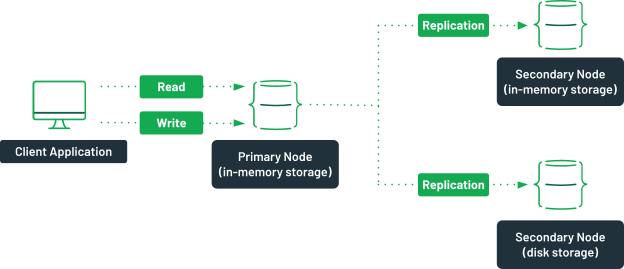
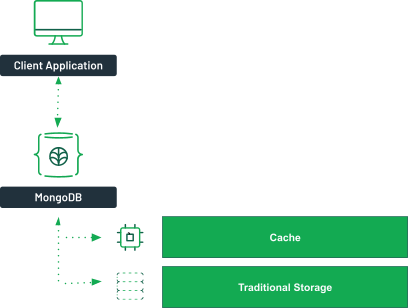

In-memory databases can be much faster than traditional databases, but is that a good enough reason to use them for your application? In this article, we will answer the question, “What is an in-memory database?” and explore how it compares with traditional databases.

## What is an in-memory database?
An in-memory database is a data storage software that holds all of its data in the memory of the host. The main difference between a traditional database and an in-memory database relies upon where the data is stored. Even when compared with solid-state drives (SSD), random access memory (RAM) is orders of magnitude faster than disk access. Because an in-memory database uses the latter for storage, access to the data is much faster than with a traditional database using disk operations.

In-memory databases provide quick access to their content; on the downside, they are at high risk of losing data in case of a server failure, since the data is not persisted anywhere. If a server failure or shutdown should occur, everything currently in the memory of that computer would be lost due to the volatile nature of RAM. It is also worth noting that the cost of memory is much higher than the cost of hard disks. This is why there is typically much more hard disk space than memory on modern computers. This factor makes in-memory databases much more expensive. They are also more at risk of running out of space to store data.

Your decision to use an in-memory database would depend on your use case. In-memory databases are great for high-volume data access where a data loss would be acceptable. Think of a large e-commerce website. The information about the products is crucial and should be kept on a persisted storage, but the information in the shopping cart could potentially be kept in an in-memory database for quicker access.

## How does an in-memory database work?
An in-memory database works in a very similar way as any other database, but the data is kept in RAM rather than on a traditional disk. Replacing the disk access with memory operations highly reduces the latency required to access data.

Using RAM as a storage medium comes with a price. If a server failure occurs, all data will be lost. As a way to prevent this, [replica sets](https://www.mongodb.com/basics/replication) can be created in modern databases such as [MongoDB](https://www.mongodb.com/try) with a mix of in-memory engines and traditional on-disk storage. This replica set ensures that some of the members of the cluster are persisting data.

_A replica set with both in-memory and traditional storage._

In this [scenario](https://docs.mongodb.com/manual/core/inmemory/#replica-set), possible with [MongoDB Enterprise Advanced](https://www.mongodb.com/products/mongodb-enterprise-advanced), the primary node of the replica set uses an in-memory storage engine. It has two other nodes, one of which uses an in-memory storage, the other one using the WiredTiger engine. The secondary node using the disk storage is configured as a [hidden member](https://docs.mongodb.com/manual/core/replica-set-hidden-member/).

In case of a failure, the secondary in-memory server would become the primary and still provide quick access to the data. Once the failing server comes back up, it would sync with the server using the WiredTiger engine, and no data would be lost.

Many in-memory database offerings nowadays offer in-memory performance with persistence. They typically use a configuration similar to this one.

[Similar setups](https://docs.mongodb.com/manual/core/inmemory/#sharded-cluster) can be done with [sharded clusters](https://www.mongodb.com/basics/sharding) when using [MongoDB Enterprise Advanced](https://www.mongodb.com/products/mongodb-enterprise-advanced).

## What are the advantages and disadvantages of in-memory databases?
The most obvious advantage of using an in-memory database is the speed to retrieve data from the database. Without the need of performing disk operations, the latency is reduced greatly and is more consistent. Because there are no more reasons to limit the number of reading operations on a disk, different algorithms can be used to search data, increasing the overall performance of an in-memory database.

It might seem like a great idea to use exclusively in-memory databases to benefit from the speed gains, but there are some drawbacks. First, the cost of RAM is about 80 times higher than the price of traditional disk space. This would significantly increase the operating costs of your infrastructure, whether the servers are hosted in the cloud or on-premises.

Secondly, the lack of data persistence in case of a failure can be an issue in some cases. While there are ways to mitigate the risks associated with these data losses, those risks might not be acceptable for your business case.

Finally, because servers typically have much less RAM than disk space, it is not uncommon to run out of space. In this case, write operations would fail, losing any new data stored.

Using an on-disk database with an [NVMe SSD](https://en.wikipedia.org/wiki/NVM_Express) can prove to be a solid alternative to in-memory databases. These disks offer a data bandwidth similar to RAM, although the latency is slightly higher.

## Why use an in-memory database?
The main use case for in-memory databases is when real-time data is needed. With its very low latency, RAM can provide near-instantaneous access to the needed data. Because of the potential data losses, in-memory databases without a persistence mechanism should not be used for mission-critical applications.

Any application where the need for speed is more important than the need for durability could benefit from an in-memory database over a traditional database.

In many cases, the in-memory database can be used only by a small portion of the total application, while the more critical data is stored in an on-disk database such as MongoDB Atlas.

## In-memory database examples
In-memory databases can find their place in many different scenarios. Some of the typical use cases could include:

* IoT data: IoT sensors can provide large amounts of data. An in-memory database could be used for storing and computing data to later be stored in a traditional database.
* E-commerce: Some parts of e-commerce applications, such as the shopping cart, can be stored in an in-memory database for faster retrieval on each page view, while the product catalog could be stored in a traditional database.
* Gaming: Leaderboards require quick updates and fast reads when millions of players are accessing a game at the same time. In-memory databases can help to sort the results more quickly than traditional databases.
* Session management: In stateful web applications, a session is created to keep track of a user identity and recent actions. Storing this information in an in-memory database avoids a round trip to the central database with each web request.

## In-memory use in MongoDB Atlas
[MongoDB Atlas](https://www.mongodb.com/cloud/atlas), the Database-as-a-Service offering by MongoDB, offers many possible configurations with regards to disk space, CPUs, and physical RAM. You can also choose the type of disk used in your cluster, such as the [NVMe SSD drives](https://docs.atlas.mongodb.com/customize-storage/#nvme-storage-on-aws), which would offer a performance close to that of a true in-memory database.

The available RAM offered for your Atlas instance will also have a significant impact on the speed at which data is accessed. This is due to how MongoDB, and more specifically its storage engine, [WiredTiger](https://www.mongodb.com/presentations/a-technical-introduction-to-wiredtiger), uses the [available memory](https://docs.mongodb.com/manual/core/wiredtiger/#memory-use).

On MongoDB Atlas instances using the M40 tier or higher, 50% of the available memory is used for caching. The other 50% is used for in-memory operations and the other services running on the server.

_WiredTiger will try to fetch data from the cache, and then rely on disk storage._

The database engine cache holds the indexes to provide quicker access to the requested data. It also contains the data from recent queries. If the incoming queries are already in the cache, it can return them just as it would if it was served from an in-memory database.

You can take a look at this [presentation](https://www.mongodb.com/presentations/mongodb-memory-management-demystified) to further understand how MongoDB manages memory.

Next steps
You now have a better answer to the question “What are in-memory databases?” These types of databases are faster than a traditional database, but also come with some caveats. They are more expensive to run and the data is not as durable as it would be with a traditional storage mechanism.

If you are ready to give in-memory databases a try, you can give the [in-memory storage engine](https://docs.mongodb.com/manual/core/inmemory/#in-memory-storage-engine) with [MongoDB Enterprise Advanced](https://www.mongodb.com/products/mongodb-enterprise-advanced) a spin or use [MongoDB Atlas](https://www.mongodb.com/cloud/atlas) as a persistence layer alongside any other in-memory database.